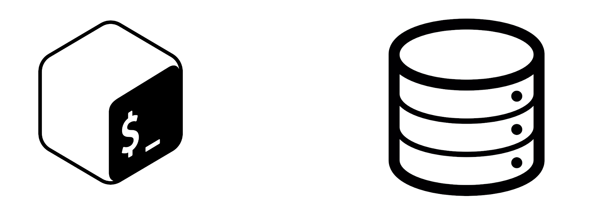

# DBMS_Shell_Script



#About the project

The Project aim to develop DBMS, that will enable users to store and retrieve the data from Hard-disk.

**To use the DBMS** :</br></br>
**First** you need to clone the project:
```
git clone git@github.com:leila672/DBMS_Shell_Script.git
```
</br>

**Then** cd to it:

```
cd DBMS_Shell_Script
```
</br>

**Finally** run the main script:

```
./main.sh
```
</br></br>


